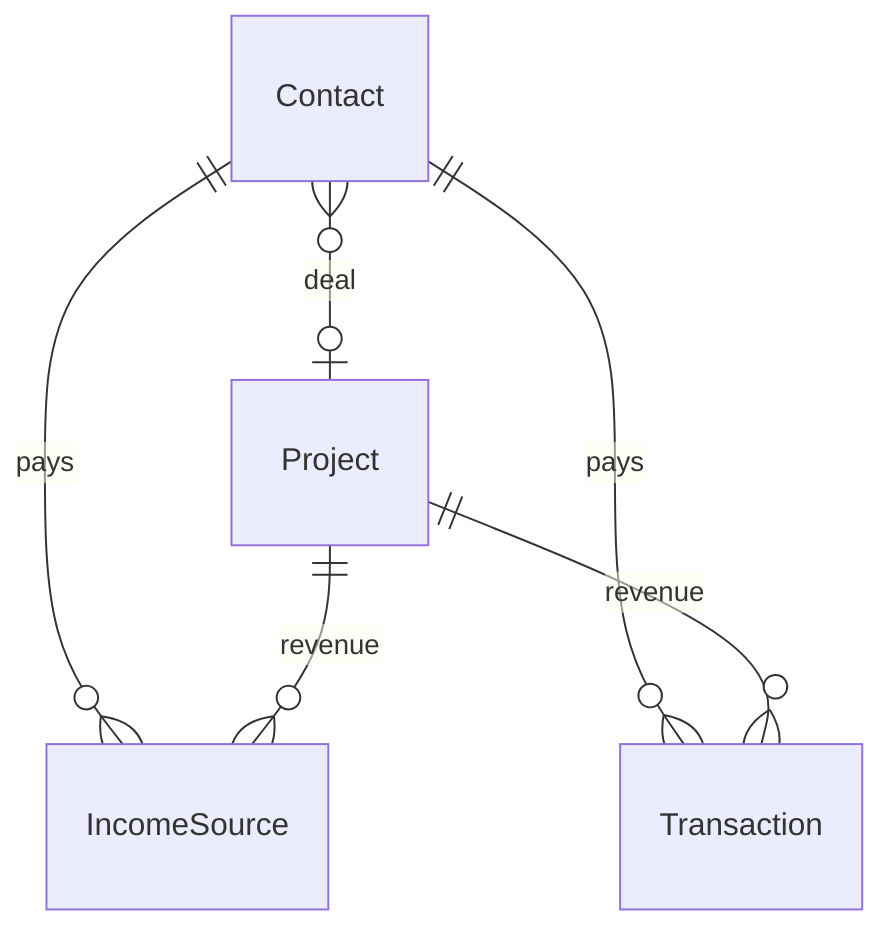

# Plano — Finanças + Contatos + Bot

Integrar o domínio financeiro existente com contatos e expor tools para o agente.

## Contexto

O módulo `finance` já inclui:

- IncomeSource, Expense, Transaction
- Invoice (+ Items) — **fatura de cartão**, não NF para cliente B2B
- BudgetPlan
- Agregados: FinanceDashboard, MonthlySummary, CalendarEvent

Hoje **não há** `contactId` em nenhuma entidade financeira.

## Onde ligar `contactId`

| Entidade | Ligar? | Motivo |
|----------|--------|--------|
| **IncomeSource** | Sim | Assinatura recorrente de cliente |
| **Transaction** (income) | Sim | Pagamento pontual de pessoa |
| **Expense** | v1.1 opcional | Fornecedor como contato |
| **Invoice** (cartão) | Não | Não representa cliente |
| **BudgetPlan** | Não | Por categoria, não por pessoa |

### Migration

```sql
ALTER TABLE income_sources ADD COLUMN contact_id UUID REFERENCES contacts(id);
ALTER TABLE transactions ADD COLUMN contact_id UUID REFERENCES contacts(id);
CREATE INDEX idx_income_sources_contact_id ON income_sources(contact_id);
CREATE INDEX idx_transactions_contact_id ON transactions(contact_id);
```

(GORM AutoMigrate com campo `ContactID *uuid.UUID` também funciona.)

## Novos endpoints

```text
GET /v1/admin/contacts/{id}/finance
  → income sources + transactions do contato

GET /v1/admin/finance/summary?contactId={uuid}
  → resumo filtrado por pessoa (opcional)
```

## Campos nos handlers existentes

Estender create/update de:

- `IncomeSource` → `contactId` opcional
- `Transaction` → `contactId` opcional

Validar: se `contactId` informado, contato deve existir e `active=true`.

## Tools do agente (finanças)

### Leitura

| Tool | API base |
|------|----------|
| `finance_dashboard` | `GET /v1/admin/finance/dashboard` |
| `finance_summary` | `GET /v1/admin/finance/summary?year=&month=` |
| `finance_calendar` | `GET /v1/admin/finance/calendar` |
| `list_income_sources` | filtros `contactId`, `projectId` |
| `list_transactions` | filtros date, type, `contactId`, `projectId` |
| `get_contact_finance` | `GET /v1/admin/contacts/{id}/finance` |

### Escrita (com confirmação)

| Tool | Ação |
|------|------|
| `create_transaction` | income/expense + `contactId` |
| `create_income_source` | recorrente + `contactId` |

**Regra:** agente deve repetir valor e contato antes de executar escrita financeira.

Exemplo:

> "Registrar receita de R$ 500,00 do cliente Maria Silva (ID …)? Confirma?"

## Fase F1 — Implementação

- [ ] Adicionar `ContactID` em models `IncomeSource` e `Transaction`
- [ ] Repository: queries por `contactId`
- [ ] Service: validação de contato
- [ ] Handlers finance: aceitar `contactId` no JSON
- [ ] `GET /v1/admin/contacts/{id}/finance`
- [ ] Tools internas agente (após A0)
- [ ] Testes

**Entregável:** receitas ligadas a pessoas; agente responde "quanto o cliente X pagou este mês?".

## Exemplo de fluxo completo

```text
Usuário: "O cliente João assinou Notes por 97 reais por mês"
  → search_contacts("João")
  → create_income_source(name="Notes - João", amountCents=9700, contactId=..., projectId=...)
  → confirmação verbal
```

## Diagrama



## Dependências

- **F1 depende de C1** (tabela `contacts` deve existir).

## Ordem no roadmap

```text
C1 → F1 → A0 → A1 (tools finance no Telegram)
```
