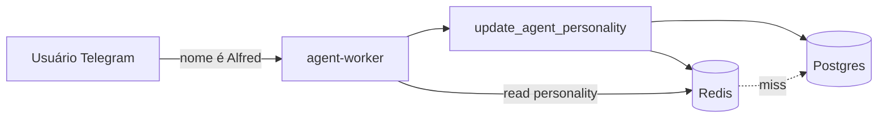

# Plano — Personalidade do Agente

Configuração dinâmica pelo próprio usuário via conversa: nome do assistente, saudações por horário, tom, voz OpenAI.

## Exemplos de comandos do usuário

| Fala do usuário | Efeito |
|-----------------|--------|
| "Seu nome a partir de agora é Alfred" | `assistantName = "Alfred"` |
| "Seu nome agora é Jarvis" | `assistantName = "Jarvis"` |
| "Sempre me atenda com 'bom dia magnata'" (manhã) | template manhã personalizado |
| "A partir de agora me atenda com 'bom dia senhor'" | template formal por período |
| "Use voz mais grave / voz alloy" | `voice = "onyx"` (Realtime/TTS) |
| "Volte ao padrão" | reset para `AgentPersonalityDefaults` |

O agente interpreta a intenção, chama a tool `update_agent_personality` e confirma na mesma conversa.

## Modelo de dados

### `AgentPersonality` (singleton por instalação)

Uma linha (ou uma por `userId` se multi-usuário no futuro). v1: **singleton global**.

```text
agent_personality
├── id                    UUID PK (fixo ou slug "default")
├── assistantName         string DEFAULT "Assistente"
├── assistantNameSetAt    timestamptz
├── greetingMorning       string — "Bom dia, magnata"
├── greetingAfternoon     string — "Boa tarde, senhor"
├── greetingEvening       string — "Boa noite, senhor"
├── greetingEnabled       bool DEFAULT true
├── systemPromptExtra     text — instruções livres anexadas ao system prompt
├── voiceId               string — OpenAI voice (Realtime/TTS)
├── language              string DEFAULT "pt-BR"
├── timezone              string DEFAULT "America/Sao_Paulo"
├── createdAt / updatedAt
```

### Vozes OpenAI (referência)

**Realtime API / TTS** — vozes comuns: `alloy`, `ash`, `ballad`, `coral`, `echo`, `sage`, `shimmer`, `verse`, `marin`, `cedar` (disponibilidade varia por modelo; conferir doc OpenAI na implementação).

Alterar `voiceId` afeta **próxima** sessão Realtime ou próximo TTS — não requer retreinar modelo.

## Saudação por horário

Lógica no `agent-worker` (não no LLM) para latência zero:

```typescript
function pickGreeting(p: AgentPersonality, now: Date): string | null {
  if (!p.greetingEnabled) return null
  const hour = toZonedTime(now, p.timezone).getHours()
  if (hour >= 5 && hour < 12) return p.greetingMorning
  if (hour >= 12 && hour < 18) return p.greetingAfternoon
  return p.greetingEvening
}
```

Prefixar a primeira mensagem da sessão ou cada turno (configurável):

| Modo | Comportamento |
|------|----------------|
| `once_per_session` | Saudação só ao abrir conversa |
| `every_message` | Prefixo em toda resposta (pode irritar — não recomendado) |

**Recomendação v1:** `once_per_session` + opcional em respostas longas após idle.

## Redis + Postgres — estratégia cache

### Por quê Redis

- Personalidade é lida **a cada mensagem** (system prompt + saudação + voz)
- Postgres sozinho: ~5–20 ms por query — aceitável, mas Redis: **<1 ms**
- Impacto na latência total: pequeno vs Whisper/GPT (centenas de ms–s), mas Redis evita carga no DB e simplifica sessões concorrentes

### Padrão write-through

```text
Leitura:
  1. GET redis key "agent:personality:default"
  2. Se miss → SELECT postgres → SET redis (sem TTL) → retorna

Escrita (tool update_agent_personality):
  1. UPDATE postgres
  2. SET redis (mesmo payload JSON)
  3. Retorna confirmação ao agente
```

### Chaves Redis

| Chave | TTL | Conteúdo |
|-------|-----|----------|
| `agent:personality:default` | **sem TTL** (vida infinita) | JSON serializado de `AgentPersonality` |

Invalidar cache: apenas no `update` — nunca TTL automático.

### Fallback sem Redis

Se `REDIS_URL` vazio → ler só Postgres (dev local). Comportamento idêntico, um pouco mais lento.

## Impacto na latência

| Operação | Custo |
|----------|-------|
| Ler personalidade (Redis hit) | ~0,5–2 ms |
| Ler personalidade (Postgres only) | ~5–20 ms |
| `update_agent_personality` (write-through) | ~10–30 ms |
| OpenAI GPT turno | 500–2000 ms |
| Whisper STT | 300–800 ms |
| Realtime áudio | 300–1000 ms |

**Conclusão:** Redis **não** muda perceptivelmente a experiência de voz vs rede/OpenAI. Vale pela consistência, simplicidade e escala. O gargalo continua sendo o modelo, não o cache.

## Tools do agente

| Tool | Descrição |
|------|-----------|
| `get_agent_personality` | Retorna config atual (nome, saudações, voz) |
| `update_agent_personality` | Patch parcial; campos opcionais |
| `reset_agent_personality` | Volta aos defaults |

### Schema `update_agent_personality`

```json
{
  "assistantName": "Alfred",
  "greetingMorning": "Bom dia, magnata",
  "greetingAfternoon": "Boa tarde, magnata",
  "greetingEvening": "Boa noite, magnata",
  "greetingEnabled": true,
  "voiceId": "onyx",
  "systemPromptExtra": "Seja formal e breve."
}
```

O LLM extrai do natural language e preenche só os campos mencionados.

### System prompt dinâmico

Montado no `agent-worker` a cada sessão:

```text
Você é {assistantName}, assistente pessoal de {ownerName}.
{systemPromptExtra}
Regras: use tools para dados reais; confirme ações destrutivas...
```

`ownerName` pode vir do `Profile.displayName` (cache Redis separado ou mesma leitura).

## Fases

### Fase P1 — Persistência + API

- [ ] Model `AgentPersonality` + defaults em código
- [ ] `GET/PATCH /v1/admin/agent/personality` (admin UI futura)
- [ ] `GET/PATCH /v1/internal/agent/personality` (agent tools)
- [ ] Redis write-through em `internal/agent/personality/service`
- [ ] `REDIS_URL` em `.env.example` + serviço Redis no `docker-compose.yml`
- [ ] Tools: `get_agent_personality`, `update_agent_personality`, `reset_agent_personality`

**Entregável:** alterar nome via API; agent-worker lê Redis no boot da mensagem.

---

### Fase P2 — Saudações por horário

- [ ] Campos `greetingMorning/Afternoon/Evening` + `greetingEnabled`
- [ ] Helper `pickGreeting` no agent-worker
- [ ] Modo `once_per_session`
- [ ] Tool update entende frases como "bom dia magnata"

**Entregável:** "bom dia senhor" / "boa tarde senhor" conforme hora em `America/Sao_Paulo`.

---

### Fase P3 — Voz (Realtime / TTS)

- [ ] Campo `voiceId` persistido
- [ ] Ao iniciar sessão Realtime: `session.update({ voice: voiceId })`
- [ ] TTS fallback: `audio.speech.create({ voice: voiceId })`
- [ ] Tool: "mude sua voz para …" → validar contra lista permitida

**Entregável:** "Seu nome é Jarvis" + voz diferente na resposta falada.

**Nota:** troca de voz mid-call no Realtime pode exigir nova sessão — documentar UX ("voz alterada na próxima mensagem").

---

### Fase P4 — Admin UI (opcional)

- [ ] Página Settings → Agent no management frontend
- [ ] Preview de saudação por horário
- [ ] Seletor de voz

## Segurança

- Apenas `AGENT_API_KEY` ou admin pode alterar personalidade
- Validar `voiceId` contra allowlist (evitar injection em campos string)
- `systemPromptExtra` com limite de tamanho (ex.: 2000 chars) — usuário pode pedir comportamento perigoso; log de alterações

## Auditoria (opcional)

```text
agent_personality_history
├── id, changedAt, changedBy (telegram user id)
├── snapshot jsonb
```

Útil para reverter "Alfred" → "Jarvis" → reset.

## Diagrama



## Dependências

- P1 pode rodar em paralelo com C1
- P2/P3 dependem de A1 (agent-worker com Telegram)

## Defaults sugeridos

```json
{
  "assistantName": "Assistente",
  "greetingMorning": "Bom dia",
  "greetingAfternoon": "Boa tarde",
  "greetingEvening": "Boa noite",
  "greetingEnabled": false,
  "voiceId": "alloy",
  "language": "pt-BR",
  "timezone": "America/Sao_Paulo"
}
```
